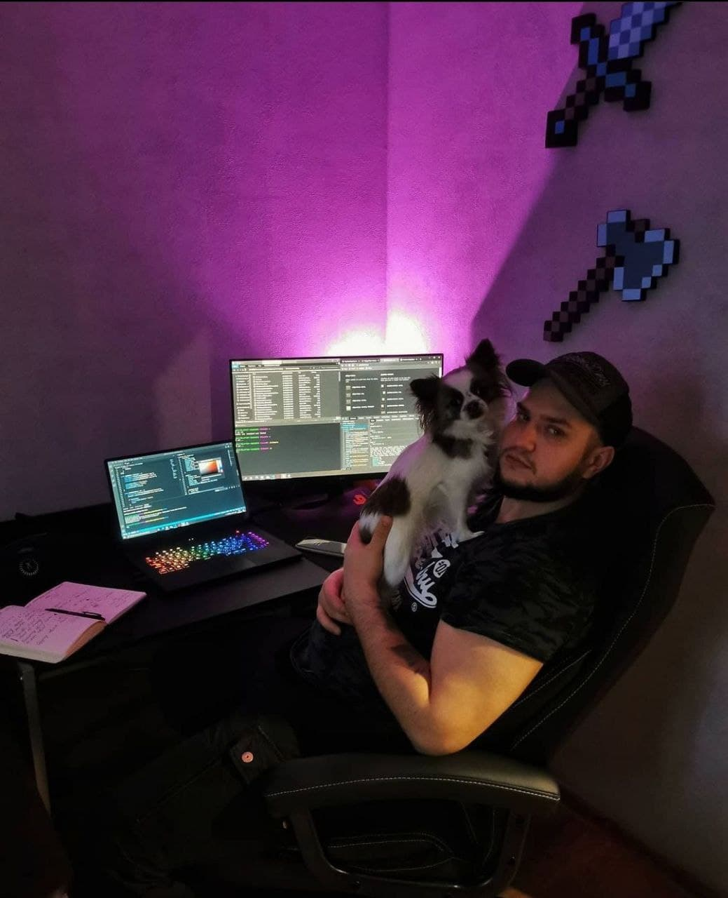

## Welcome 

Hi! My name is Sergii Kirianov and welcome to my personal blog. 
This is my first ever experience of writing blog posts. 

I have made it as a track record of my learning path and will be sharing my personal view on the Web Development concepts.

I am a self-taught web-developer with marine background. I have started learning web development about a year ago, but I always had a passion to tech and programming. I am curious and always was wondering how things are working from inside, under the hood. 
When I was a teen, I played an online MMORPG game called RF Online and once I found that you can actually repaint skins only using photoshop. I made a deal with GM and he was giving me free donate stuff for my job :D 

In school I was really good at programming during our short course of studying it. When I join university, I was creating a programs for Excel for calculating labs and projects and selling it for money :D Even on my current job, I have been creating programs in Excel, until I by mistake found out, that behind macroses in Excel is actually Visual Basic code. From then onwards, I have realised that I have been doing programming all this time, just no-code version of it. 

I went through popular way and just googled "Top programming languages". I have started learning html, css and js. I enjoyed JavaScript the most and then somewhere I found a suggestion to start with "Eloquent JavaScript". That was a mistake. The books is excellent, but it just made my life miserable. I thought that I am complete idiot, because I could not understand a single line there. I stopped my learning path then. 

After about 6 months, I got a feeling that I just want to try again. I took FreeCodeCamp approach. It was excellent. I was so much excited to complete each and every challenge. When I have completed FCC, I felt like flying. I have completed it quite fast and found it was rather simple. Then hundreds of blog posts, hundreds of tutorials and I am unstoppable, meaning I cannot stop consumign the information. I just got sucked so badly, that I cant stop enjoying it.

I like to dive deep in every aspect of my jobor future job, so I am continously increasing my foundational knowledge and understanding. This is now the place, where I would like to share my understanding. If you found me wrong, please let me know. I am alone on this path and have no friends to share my knowledge or ask questions.

Cheers.